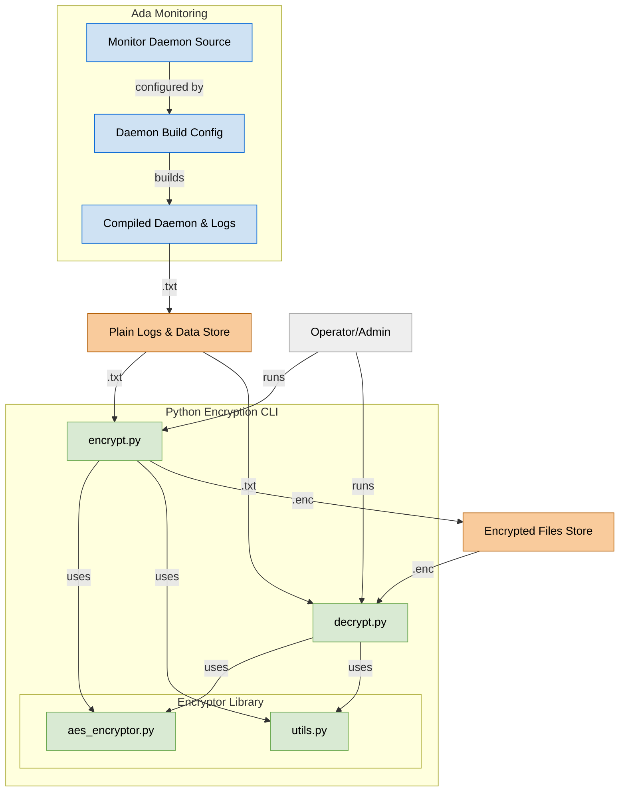

# 🔐 Security: Cryptography & System Security Framework (KENDRAH-RA1018 Module)

[](https://github.com/bcicdis/security/issues)


**Security** is a cryptographic and system security framework written in **Ada** and **Python**, built as a submodule of the [KENDRAH-RA1018](https://github.com/bcicdis/KENDRAH-RA1018) toolsuite. It is currently in development and intended for **military-grade encryption** and secure data operations.

---

## 🛡️ Overview

The current capabilities include:

- 🟦 **Ada Monitoring Daemon**  
  A background service written in Ada, designed to generate and manage system logs. Will evolve into a real-time event-monitoring tool.

- 🟩 **Python CLI for Encryption/Decryption**  
  Uses **AES-256** to encrypt and decrypt `.txt` files via command-line tools, with utilities abstracted in a modular encryptor library.

- 🟨 **Layered Data Stores**  
  - Plaintext logs (`.txt`)
  - Encrypted files (`.enc`)
  These are strictly separated for clarity and security.

---

## 🔐 Current Capabilities

- AES-256 based symmetric file encryption & decryption
- Ada daemon for generating logs and future monitoring extensions
- Modular structure with encryption logic and utility tools
- Command-line based interface for operator control
- Initial integration with KENDRAH-RA1018 system tools

## Diagram (Current)




---

## 🧪 How to Use

### 🔧 Encrypt a file:

```bash
python encrypt.py path/to/file.txt
```

### 🔓 Decrypt a file:

```bash
python decrypt.py path/to/file.txt.enc
```

### 🛠 Build the Monitoring Daemon (Ada):

```bash
gprbuild default.gpr
```

---

## 🚧 Roadmap

- [ ] Implement RSA key-pair encryption
- [ ] Add support for secure hashes (e.g., SHA-512, BLAKE3)
- [ ] Real-time system event monitoring
- [ ] Secure and automated key management
- [ ] Web-based management interface
- [ ] Enhanced daemon log analysis module

---

## 🤝 Suggestions & Feedback

Got ideas? Visit the [Issues](https://github.com/bcicdis/security/issues) page or join discussions. Your feedback is welcomed and valued as we iterate on a stronger, more capable system.

---

## 📜 Licensing

> **Note:** This framework is **not open-source**.  
> Licensed under a **proprietary license**.  
> All rights reserved by **Black Corp: Intelligence**.

Unauthorized distribution or reproduction is prohibited.

---

*Part of the [KENDRAH-RA1018](https://github.com/bcicdis/KENDRAH-RA1018) Security Framework Suite.*
