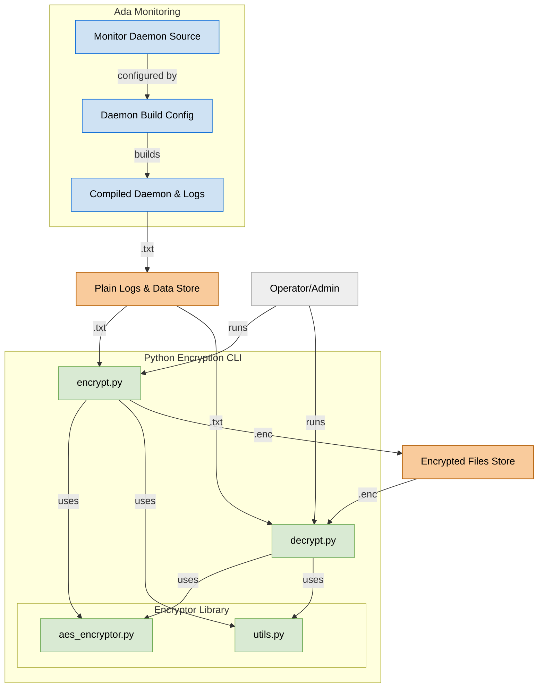

# System Security Monitoring

# Diagram (Current)

```mermaid
flowchart TB
    %% Ada Monitoring Layer
    subgraph "Ada Monitoring" 
        direction TB
        MD_src["Monitor Daemon Source"]:::ada
        MD_build["Daemon Build Config"]:::ada
        MD_artifact["Compiled Daemon & Logs"]:::ada
        MD_src -->|"configured by"| MD_build
        MD_build -->|"builds"| MD_artifact
    end

    %% Data Store for Plain Logs
    DataStore_plain["Plain Logs & Data Store"]:::datastore

    %% Python Encryption CLI Layer
    subgraph "Python Encryption CLI" 
        direction TB
        CLI_encrypt["encrypt.py"]:::python
        CLI_decrypt["decrypt.py"]:::python

        subgraph "Encryptor Library"
            direction TB
            AES["aes_encryptor.py"]:::python
            Utils["utils.py"]:::python
        end

        CLI_encrypt -->|"uses"| AES
        CLI_encrypt -->|"uses"| Utils
        CLI_decrypt -->|"uses"| AES
        CLI_decrypt -->|"uses"| Utils
    end

    %% Encrypted Data Store
    DataStore_enc["Encrypted Files Store"]:::datastore

    %% Operator/Admin
    Admin["Operator/Admin"]:::external

    %% Data Flows
    MD_artifact -->|".txt"| DataStore_plain
    Admin -->|"runs"| CLI_encrypt
    Admin -->|"runs"| CLI_decrypt
    CLI_encrypt -->|".enc"| DataStore_enc
    DataStore_enc -->|".enc"| CLI_decrypt
    DataStore_plain -->|".txt"| CLI_encrypt
    DataStore_plain -->|".txt"| CLI_decrypt

    %% Click Events
    click MD_src "https://github.com/bcicdis/security/blob/main/src/monitor_daemon.adb"
    click MD_build "https://github.com/bcicdis/security/blob/main/default.gpr"
    click MD_artifact "https://github.com/bcicdis/security/tree/main/obj/"
    click CLI_encrypt "https://github.com/bcicdis/security/blob/main/cryptography/military_grade_encryption/encrypt.py"
    click CLI_decrypt "https://github.com/bcicdis/security/blob/main/cryptography/military_grade_encryption/decrypt.py"
    click AES "https://github.com/bcicdis/security/tree/main/cryptography/military_grade_encryption/encryptor/"
    click Utils "https://github.com/bcicdis/security/tree/main/cryptography/military_grade_encryption/encryptor/"
    click DataStore_plain "https://github.com/bcicdis/security/tree/main/cryptography/military_grade_encryption/data/"
    click DataStore_enc "https://github.com/bcicdis/security/tree/main/cryptography/military_grade_encryption/data/"

    %% Styles
    classDef ada fill:#cfe2f3,stroke:#0366d6,color:#000
    classDef python fill:#d9ead3,stroke:#6aa84f,color:#000
    classDef datastore fill:#f9cb9c,stroke:#b45f06,color:#000
    classDef external fill:#eeeeee,stroke:#aaaaaa,color:#000
```
